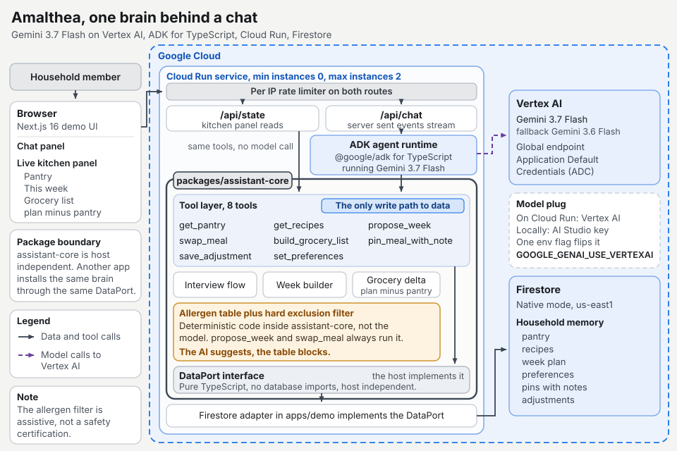

# Amalthea

A meal-planning assistant that interviews first and plans second. It knows the
household's pantry, recipes, allergies, and budget. It asks clarifying
questions before generating anything, builds the week, explains its picks, and
rebuilds the grocery list live as plan-minus-pantry, so the family uses what
it has and buys only what it needs.

Built for the All Things Agentic hackathon on Devpost.

**Live demo:** https://amalthea-demo-947902910401.us-east1.run.app

**Disclosure: all code in this repository was newly created during the
submission period. No pre-existing code.**

## Stack

- **Gemini 3.7 Flash** (`gemini-3.7-flash`, fallback `gemini-3.6-flash`).
  Called through the Gemini API locally, and through **Vertex AI** on the
  deployed service (`GOOGLE_GENAI_USE_VERTEXAI=true` with Application Default
  Credentials). One env flag, no code change.
- **ADK for TypeScript** (`@google/adk`) for the agent runtime, tools, and
  sessions.
- **Cloud Run** hosts the demo service. **Firestore** holds household memory.

## Workspace

- `packages/assistant-core` is the brain: interview flow, week builder,
  grocery list delta, allergen table with a hard-exclusion filter, and the
  tool contract. Pure TypeScript. No UI and no database imports. All data
  access goes through a small port interface the host application implements.
- `apps/demo` holds the Next.js demo UI, the Firestore adapter that implements
  the port, and the Cloud Run service.

Allergen exclusions are enforced by a deterministic lookup table in
`assistant-core`, applied outside the model: the model suggests, the table
blocks. The table is an assistive filter, not a safety certification.

## Spin-up

Requires Node 24.13 or newer. Install and run the test suite. Neither step
needs an API key or the emulator.

```bash
npm ci
npm test
```

That runs 75 tests across `assistant-core` and the demo app.

To run the agent locally:

1. Copy `env.example` to `.env.local` at the repo root and set `GEMINI_API_KEY`.
   A free AI Studio key works for chat.

2. Start the Firestore emulator and leave it running in its own terminal. This
   needs Java installed.

   ```bash
   npm run emulator
   ```

3. Seed the synthetic Reyes household into the emulator, in a second terminal.
   The seed script targets the local emulator by default and only writes to
   live Firestore when `SEED_LIVE=true` is set explicitly, so a stray run
   cannot touch a real project.

   ```bash
   npm run seed --workspace @amalthea/demo
   ```

4. Start the dev server and open http://localhost:3000.

   ```bash
   npm run dev
   ```

The emulator keeps nothing between runs, so a restart gives you an empty
database. Reseeding takes a couple of seconds, so just run the seed command
again.

**Warning: `npm run build` followed by `npm start` does not work locally,
because neither script exists at the repo root.** Production runs from the
`Dockerfile` on Cloud Run instead, serving the standalone Next output that bakes
its config in at build time and never evaluates `next.config.ts`, where the
repo-root env loading and the emulator default live.

## Architecture



Next.js UI to API route to ADK agent on Gemini 3.7 Flash, through the tools
layer (the only write path) to Firestore. On Cloud Run the model runs on Vertex
AI (Gemini 3.x is served from the global endpoint) with Application Default
Credentials, flipped by one env flag. Adversarial testing and endpoint
protection are written up in
[docs/adversarial-testing.md](docs/adversarial-testing.md).
